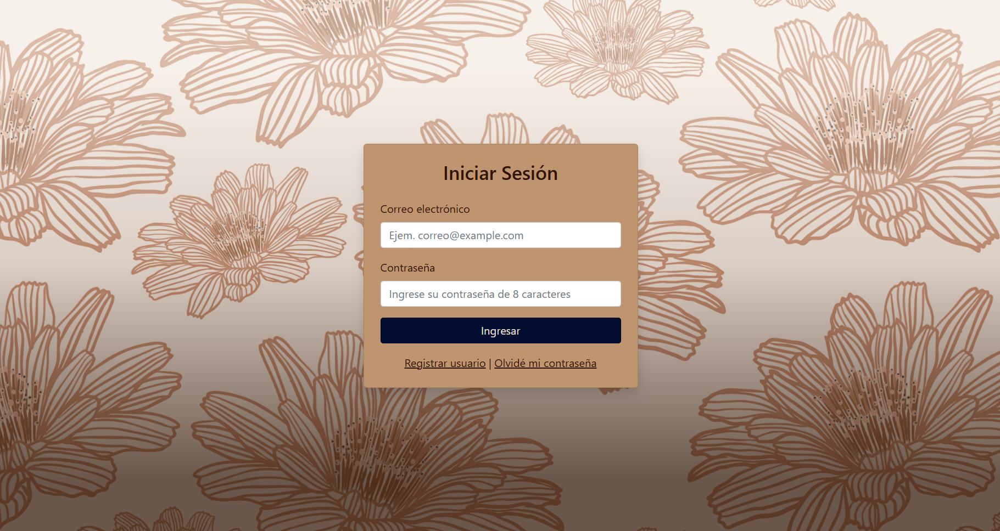
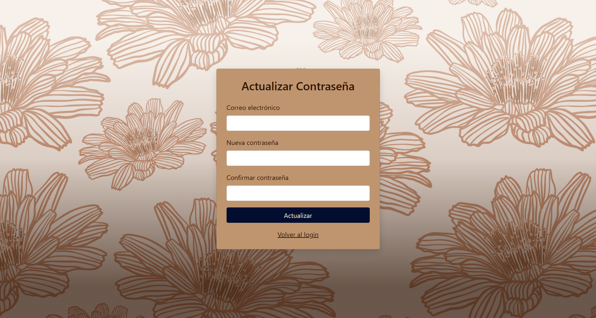
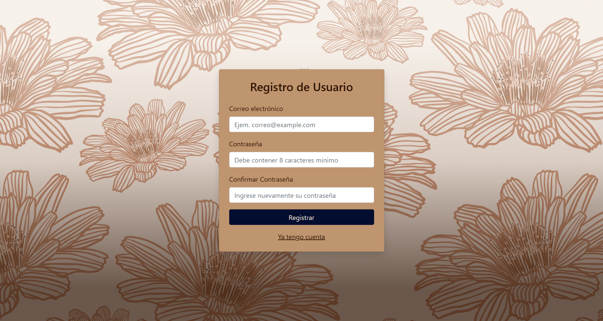
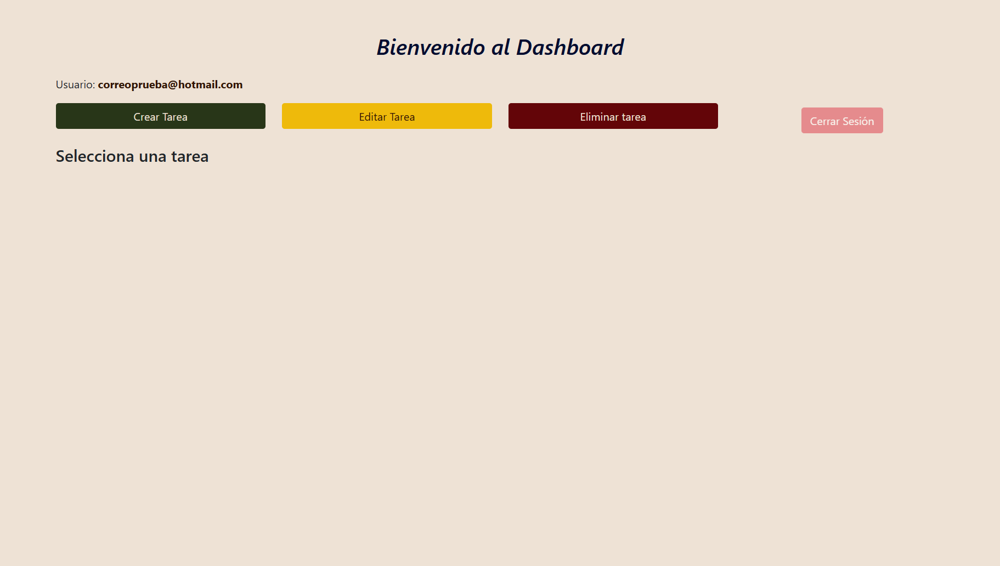
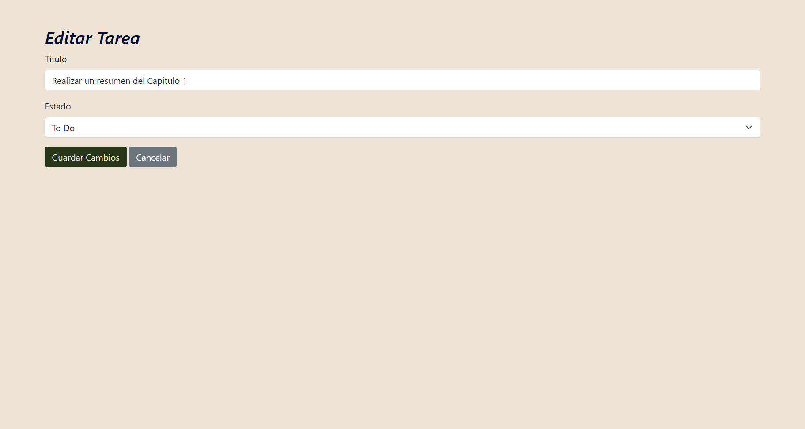
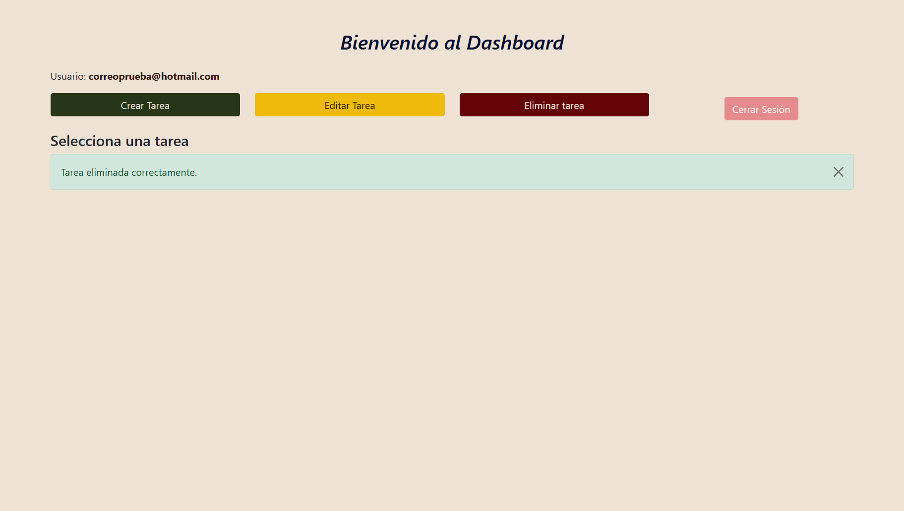

# K-BAN || ToDo para el día de hoy

## Descripción
> El tema central del proyecto, es la aplicación del desarrollo Backend. Con un "ToDo" personalizado para cada usuario. Implementa una arquitectura MVC, con persistencia de datos en MySQL.
> 
> La aplicación ofrece en un INDEX como punto de entrada, un sistema de inicio de sesión con validación frontend de correo y contraseña, y una funcionalidad de registro de usuarios que exige una contraseña de al menos 8 caracteres y su confirmación. La opción de "Recuperar contraseña" permite actualizar la clave en la base de datos, solicitando también un mínimo de 8 caracteres.
>
> Dentro de la aplicación, cada usuario autenticado puede crear, editar y eliminar sus propias tareas. Finalmente, se incluye una función de cierre de sesión para garantizar la seguridad.
<br>

## Estado del repositorio 📊️
<div align="center" style="display: inline_block">


</div>
<br>

## Tecnologías utilizadas 🔨
<div align="center" style="display: inline_block">


</div>
<br>

### Notas importantes ⚠
  - Este proyecto está redactado en inglés con comentarios y descripciones en español.
<br>

## Instalación y configuración 🚀
<b>1️⃣ Requisitos</b>
1. XAMPP instalado (incluye Apache, PHP y MySQL).
2. Navegador web (Chrome, Firefox, etc.).

<b>2️⃣ Configuración del entorno</b>
1. Clona este repositorio: `git clone https://github.com/odrasanchezdev/K-BAN`
2. Añade esta carpeta a htdocs en XAMPP:
``` C:\xampp\htdocs\mi_todolist ```
3. Inicia los servicios de Apache y MySQL desde el Panel de Control de XAMPP.
4. Abre http://localhost/phpmyadmin en tu navegador.
5. Crea una nueva base de datos, usando los querys que se encuentran en el archivo kanban.sql.
6. Importa el archivo database.sql incluido en el proyecto.

<b>3️⃣ Configuración del proyecto</b>
1. Abre el archivo de configuración (```conexion.php```) y actualiza los datos de conexión si es necesario:
```
$host = "localhost";
$user = "root";
$pass = "";
$db   = "kanban";
```
2. Guarda los cambios.

<b>4️⃣ Ejecución</b>
1. En tu navegador, visita:  ``` http://localhost/src/ ```
2. Regístrate o inicia sesión para usar la aplicación.
3. Agrega, edita o elimina tus tareas en la lista.


### Capturas de pantalla 📷
<table>
  <tr>
    <td></td>
    <td></td>
  </tr>
  <tr>
    <td></td>
    <td></td>
  </tr>
  <tr>
    <td></td>
    <td></td>
  </tr>
</table>
<br>

## Soporte
Si tienes alguna pregunta, encuentras un error en alguno de los documentos o deseas sugerir una mejora, ¡no dudes en abrir un issue en este repositorio! Nos encantaría recibir tus comentarios.

* ¿Encontraste un error? Abre un issue y describe el problema.
* ¿Tienes una sugerencia? Abre un issue y comparte tu idea.

Acercate a mis redes sociales para atender tus dudas y sugerencias en la sección de [Contacto](#contacto-)
<br>

## Licencia ✅
Se permite el uso, copia y distribución de este proyecto, siempre y cuando se mantenga la atribución original y no se sublicencie. No se permite su distribución, modificación o uso comercial sin permiso expreso del autor.

Copyright (c) 2025 at Odra Sanchez. Enlace del perfil:
<div align="center" style="display: inline_block">
  
<a href="https://github.com/odrasanchezdev"></a>
</div>
<br>

## Contacto 🌐
Si tienes alguna pregunta o sugerencia, no dudes en contactarme:
<div align="center" style="display: inline_block;">
  
 <a href="https://odrasanchezdev.super.site/"></a>
 <a href="https://www.linkedin.com/in/odrasanchez/"></a>
 <a href="https://ko-fi.com/odrasanchez"></a>
 <a href="https://www.behance.net/odrasanchezdev"></a>
 <a href="https://t.me/odrasanchezdev"></a>
 
</div>
